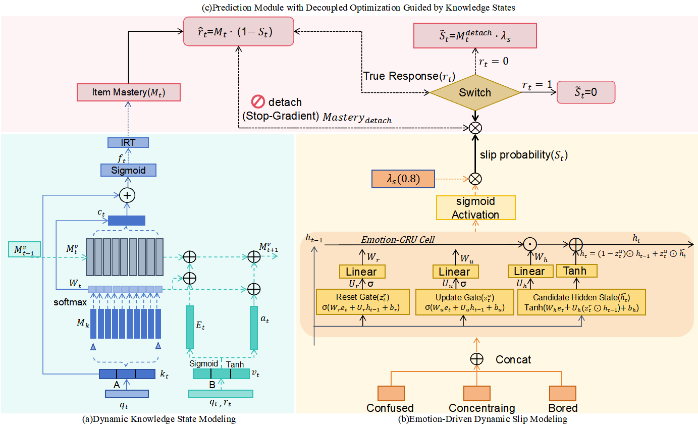

# DESKT
PyTorch implementation of DESKT (Decoupled Emotion-Driven Slip-Aware Knowledge Tracing).

## Abstract
The aim of knowledge tracing (KT), which is a core task in intelligent educational systems, is to dynamically estimate the knowledge states of students and predict their future performance from historical learning interactions. In existing methods, incorrect responses are implicitly assumed to stem solely from insufficient knowledge mastery, thereby overlooking slips induced by noncognitive factors (e.g., emotional states) and treating them as noise to be suppressed. This assumption biases knowledge state estimation and limits the interpretability of model predictions. To address these limitations, we propose a decoupled emotion-driven slip-aware KT model (DESKT) that comprises two core modules: (i) a dynamic knowledge state modeling module that integrates the dynamic key--value memory networks (DKVMN) with item response theory (IRT) to estimate students' knowledge mastery and (ii) an emotion-driven dynamic slip module that uses an Emotion-GRU to estimate slip probabilities from emotional features. During inference, the knowledge mastery probability and slip probability are fused via multiplicative fusion. Furthermore, we introduce a knowledge state--guided decoupling optimization strategy that ensures independent and stable training of the two modules through gradient isolation and weakly supervised pseudolabels. The results of experiments on ASSISTments 2012 and ASSISTments 2017 demonstrate that DESKT consistently outperforms mainstream baseline models. Ablation studies and interpretability analyses further validated the effectiveness of each key component and the ability of the model to provide interpretable explanations for anomalous response behavior.

## Overall Architecture

## Dataset
We evaluate our method on two benchmark datasets for knowledge tracing, i.e., ASSISTments 2012 and ASSISTments 2017.

In addition to the ASSISTments 2017 dataset provided in the code, the ASSISTments 2012 dataset mentioned in the paper is available for download via this [link](https://sites.google.com/site/assistmentsdata/datasets/2012-13-school-data-with-affect)

## Models
The statistics of the datasets after processing are as follows:
The project code structure is as follows:
- `/model.py`: DESKT end-to-end model architecture (knowledge state module + slip module + decoupled optimization)
- `/data_loaders.py`: Data loading 
- `/preprocess_data.py`: Raw data preprocessing script
- `/train.py`: Model training and validation pipeline
- `/main.py`: Program entry point, supporting training/testing experiments
- `/utils/`: Utility functions (metrics calculation, visualization, etc.)

## Setup
The following environment is required to run this code:

- A machine with GPUs (recommended: NVIDIA GPU with CUDA 11.x)
- Python 3.10
- Required packages: torch, numpy, pandas, scipy, scikit-learn, matplotlib, tqdm, PyYAML, yacs, iopath

## Hyperparameter Settings
Key hyperparameters can be set in the YAML configuration files under the `configs/` directory, or passed directly via command line:

| Parameter | Value | 
|-----------|-------|
| `embed_dim` | 64 | 
| `hidden_dim` | 64 | 
| `dropout` | 0.05 | 
| `batch_size` | 128 | 
| `learning_rate` | 1e-3 | 
| `early_stop` | 10 | 

## Save Log
To save training logs, please create a `logs/` folder in the project root directory. During training, the following will be automatically saved:

- Training curves (AUC/ACC vs. Epoch)
- Best model checkpoint (saved under `saved_model/`)
- Hyperparameter configuration records

## Contact us
If you have any questions, please contact liyanchun018@stu.tjnu.edu.cn
